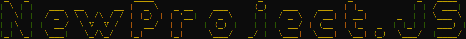

# Table of Contents

- [What Is NewProject.JS](#newproject.js)
- [NewProject.JS features](#features)
- [Installation and Usage](#usage)
- [Changelog](#changelog)

# NewProject.JS

A small Node.JS CLI script that automatically creates a new project, `package.json`, `index.js` and `README.md` files for you!

# Features

Currently, NewProject.JS has a small set of features, that, with multiple updates, could be expanded
- Create a new directory
    - Create an `index.js`, `package.json` and `README.md` files inside the directory
    - Open Visual Studio Code after creating the directory and files
- Initializes an empty Git repository
    - Adds a .gitignore file ignoring '/node_modules'

# Usage

Run `npm i -g @andremont0101/newproject.js`\
Use NewProject.JS by running the CLI script inside the directory where you want to make the project with `newproject` and typing the desired project name when prompted (cannot contain spaces otherwise VSCode will open individual files per each space and not actually the directory.)

# Changelog

## 1.4.1
- Fixed an issue with the auto-generated `package.json` not being used by NPM to define the installed packages
- Added Git support
    - An empty GitHub repository is now started in the new project folder
    - A .gitignore file is automatically created and auto ignores /node_modules
- Fixed a typo in the README
- Updated the updater.checkForUpdate() function.
- Finally gave use to yargs, you can now check your current version by typing `newproject --version`